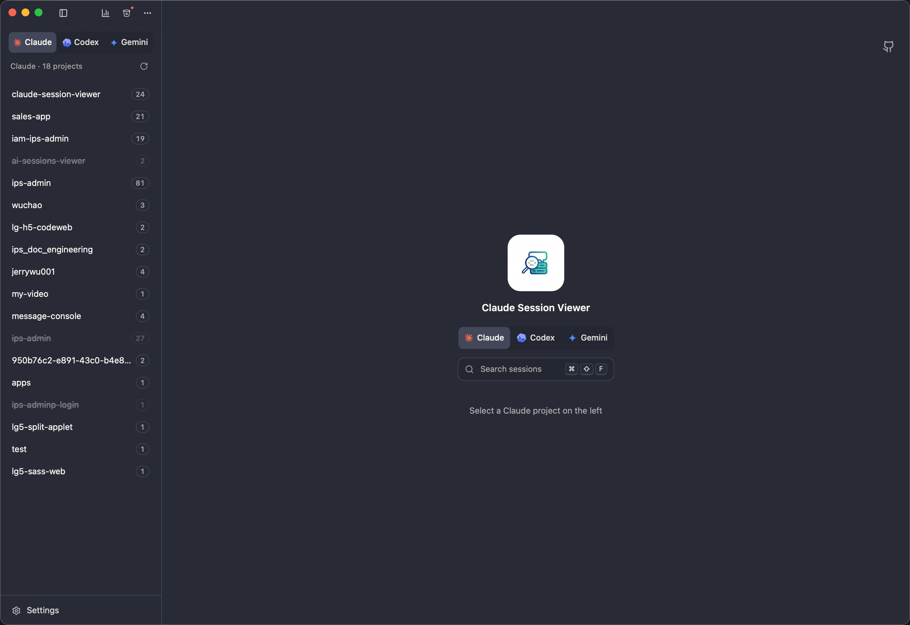
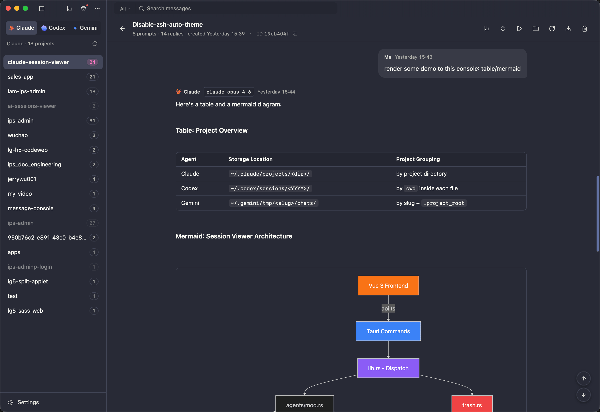
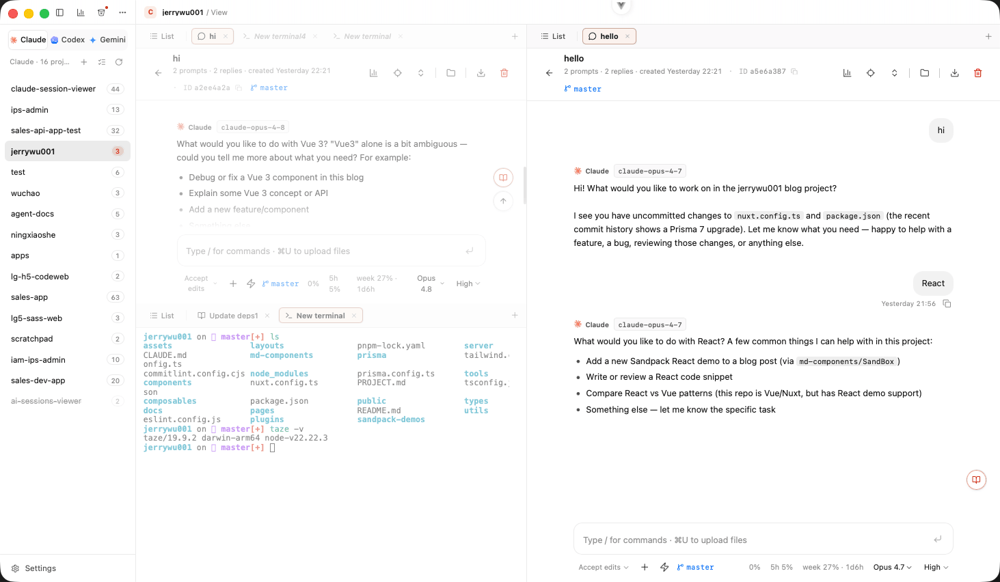
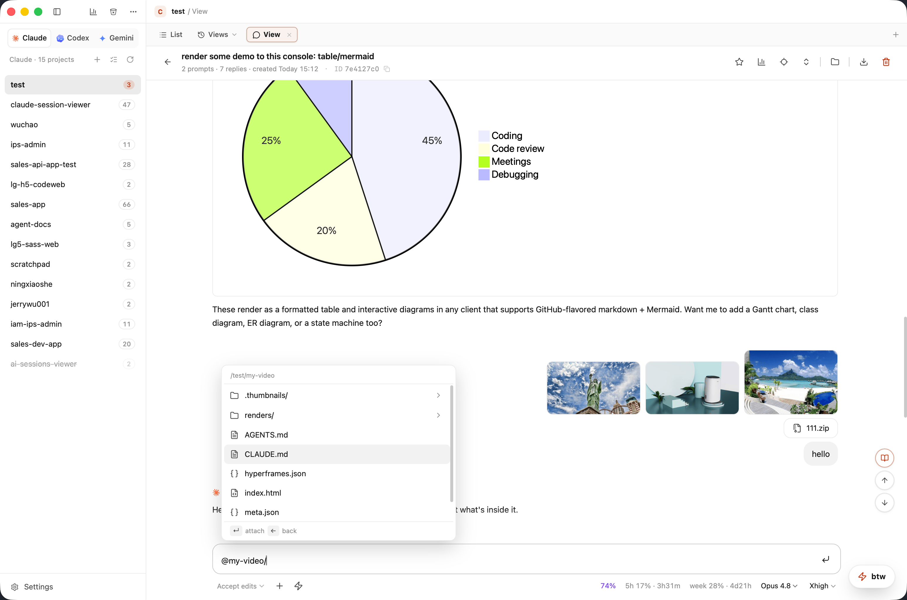
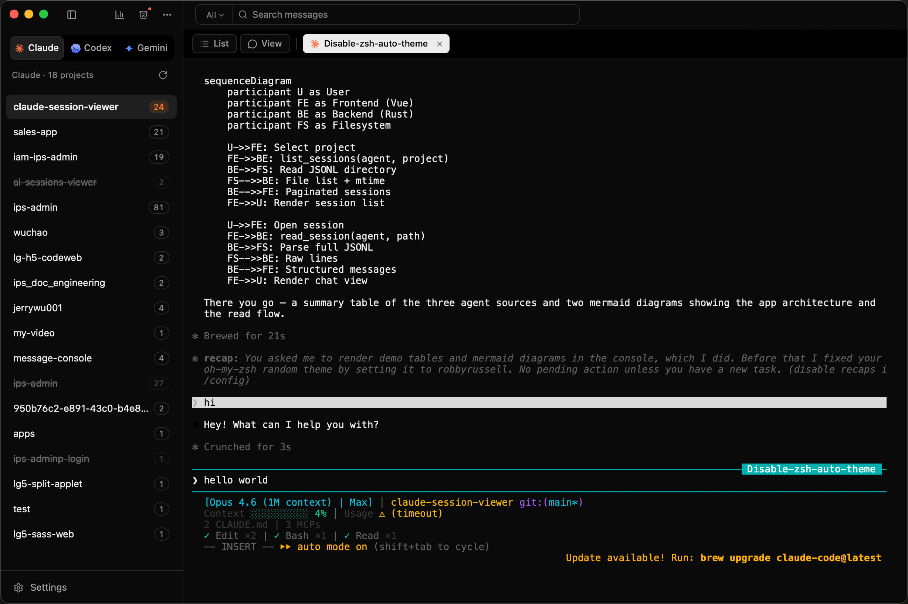
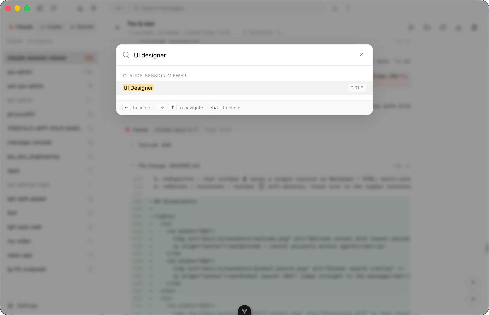
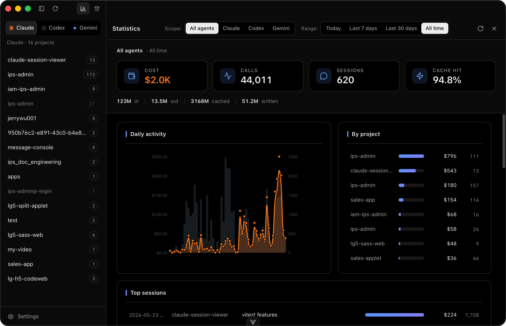
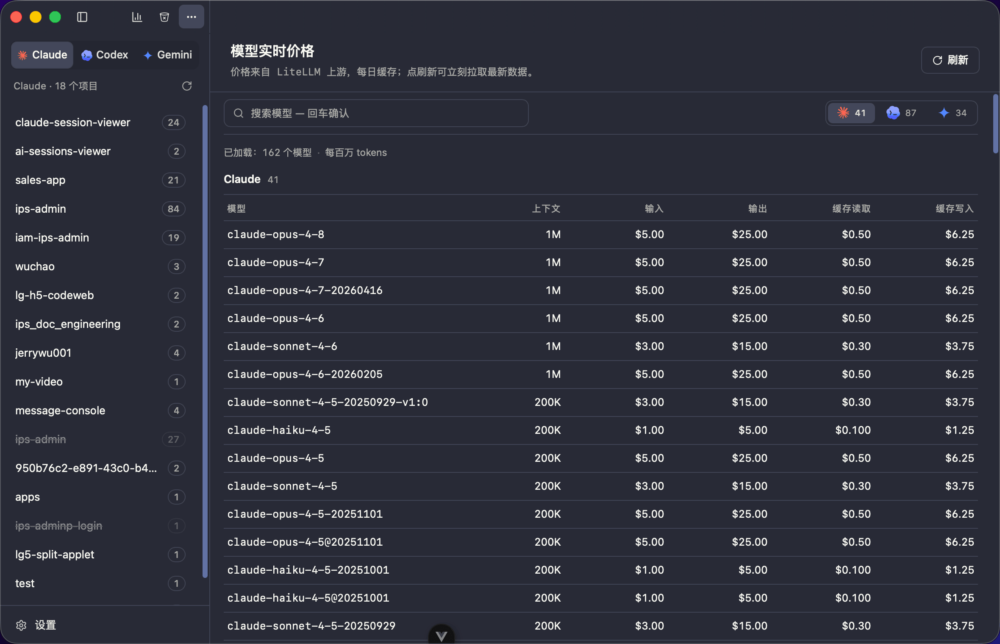
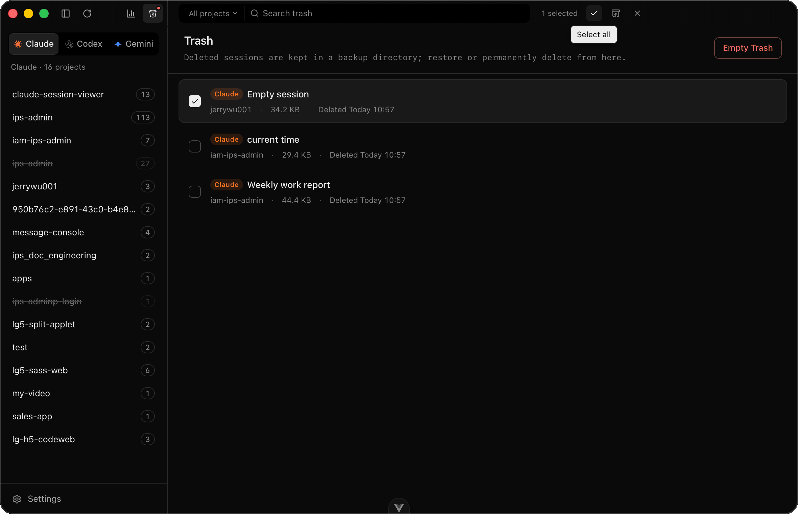
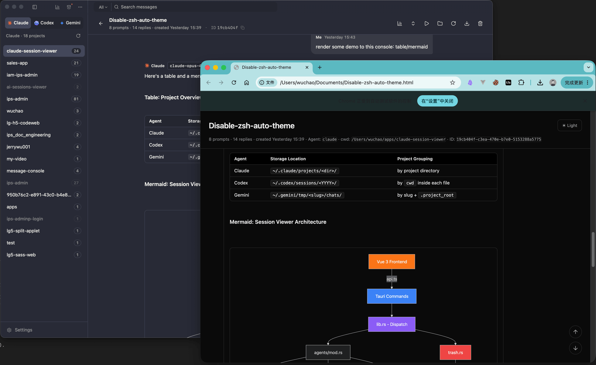

<div align="center">

# Sessions Viewer

[](https://github.com/jerrywu001/cc-sessions-viewer/releases)
[](https://github.com/jerrywu001/cc-sessions-viewer/releases)
[](https://tauri.app/)
[](https://github.com/jerrywu001/cc-sessions-viewer/releases/latest)
[](https://github.com/jerrywu001/cc-sessions-viewer)
[](LICENSE)

[English](README.md) · **中文** · [日本語](README.ja.md) · [**文档站**](https://sessions-viewer.js-bridge.com/zh/) · [CHANGELOG](CHANGELOG.md)

<p align="center">一个专为 <strong>Claude Code</strong>、<strong>Codex</strong>、<strong>Grok Build</strong>、<strong>Kimi Code</strong>、<strong>Pi</strong>、<strong>Antigravity CLI</strong> 和 <strong>opencode</strong> 打造的原生桌面浏览器。<br/>在一处读取、搜索并管理七个 CLI 的本地会话记录。</p>

<p align="center">另有一整页<strong>工具管理</strong> —— 把散落在各家 agent 的 skills 收拢干净（重复、断链、同一份存了三处），<br/>并接管 MCP server、hooks 与全局指令文件。<a href="https://sessions-viewer.js-bridge.com/zh/tools/"><strong>使用文档 →</strong></a></p>

</div>

https://github.com/user-attachments/assets/9bcb92a8-e5b8-40e5-b492-af252162309b

---

## 项目定位

Sessions Viewer 将本地 agent 会话记录整理成可搜索的工作区。打开项目，准确回看发生了什么，再从同一位置继续工作，无需手动翻找 JSONL 文件。

> [!TIP]
> **新增 —— 工具管理。** 七家 agent 的 skills、MCP server、hooks 和全局指令文件，集中在一个页面。把本机重复的 skill 和断掉的链接找出来并修好，在开口之前先看清楚 MCP server 吃掉多少上下文，hook 可以先试跑再决定要不要信它。每一次改动都先把会改哪些文件摆给你看。
>
> → **[查看工具管理文档](https://sessions-viewer.js-bridge.com/zh/tools/)**

### 阅读与定位

- **忠实还原** — 完整呈现思考链路、工具调用配对、结构化 Diff 与内嵌截图。
- **全局搜索** — 跨项目搜索并直达具体消息，快捷键为 `⌘⇧F`。
- **定位提问** — 在紧凑列表中浏览所有用户提问，点击后滚动到目标消息并闪烁高亮。
- **视图历史** — 按项目保存可搜索的阅读和聊天视图，支持收藏和一键返回。

### 继续工作

- **应用内对话** — 在内置聊天里新开或续聊 Claude Code、Codex 会话，实时切换模型、推理强度（含 Opus **Ultracode**）与权限模式。
- **一键恢复** — 在窗口内嵌终端或 **Terminal.app**、**cmux**、**iTerm2**、**Ghostty**、**Warp** 中恢复或新建会话。
- **Shell 标签** — 在 agent 会话旁运行普通 shell 命令，标签状态跨重启保留。
- **启动参数** — 为每个 agent 配置 CLI 参数（如 `--dangerously-skip-permissions`），新建或恢复时自动追加。

### 管理项目

- **分屏** — 左右并排或上下堆叠多个分屏，拖动标签在分屏间移动；每个项目的布局跨重启保留。
- **cmux 集成** — 按工作目录复用 workspace、定位运行中的会话、智能选择拆分方向，并按目录名命名标签。
- **书签** — 将常用文件夹固定到侧栏，按 agent 独立管理。
- **重命名与回收站** — 会话重命名同步回 CLI，软删除后可从共享回收站恢复。

### 统计与导出

- **统计与实时价格** — 基于 models.dev 实时价目按项目、模型或工具分析 Token 与成本；macOS 菜单栏显示各 agent 的 Today / 7d / 30d 汇总。
- **灵活导出** — 单会话或批量导出为离线可读的 Markdown、HTML 或无损 JSON。
- **只读安全** — 原始 JSONL 始终只读，不会被修改或删除。

### 支持的会话来源

Claude Code、Codex、Grok Build、Kimi Code、Pi、Antigravity CLI 和 opencode。Grok Build、Kimi Code 与 Pi 支持历史记录、终端、导出、统计和续跑流程；它们的 GUI Chat 暂不包含在内。

每一种把会话存在磁盘的什么地方、怎么用命令行直接读，都写在[sessions-viewer.js-bridge.com/zh/agents/](https://sessions-viewer.js-bridge.com/zh/agents/)。

## 截图

<details>
  <summary>展开查看产品截图</summary>

<table>
  <tr>
    <td width="50%">
      
      <p align="center"><em>主视图 — 侧栏、会话列表与聊天</em></p>
    </td>
    <td width="50%">
      
      <p align="center"><em>忠实还原 — 思考、工具调用、结构化 Diff</em></p>
    </td>
  </tr>
  <tr>
    <td width="50%">
      
      <p align="center"><em>分屏 — 多个会话并排显示，标签可在分屏间拖动</em></p>
    </td>
    <td width="50%">
      
      <p align="center"><em>应用内聊天 — Mermaid 与表格渲染、@ 提及文件、粘贴图片</em></p>
    </td>
  </tr>
  <tr>
    <td width="50%">
      
      <p align="center"><em>内嵌终端 — 一键恢复或新建会话</em></p>
    </td>
    <td width="50%">
      
      <p align="center"><em>全局搜索（⌘⇧F）直达目标消息</em></p>
    </td>
  </tr>
  <tr>
    <td width="50%">
      
      <p align="center"><em>按项目 · 模型 · 工具维度分析 Token 与成本</em></p>
    </td>
    <td width="50%">
      
      <p align="center"><em>菜单栏统计 — 各 agent 花费与 Token 概览</em></p>
    </td>
  </tr>
  <tr>
    <td width="50%">
      
      <p align="center"><em>实时模型价格面板</em></p>
    </td>
    <td width="50%">
      
      <p align="center"><em>共享回收站 — 软删除，一键恢复</em></p>
    </td>
  </tr>
  <tr>
    <td width="50%">
      
      <p align="center"><em>设置 — 终端选择与启动参数</em></p>
    </td>
    <td width="50%">
      
      <p align="center"><em>导出 HTML — 完全离线，浏览器直接打开</em></p>
    </td>
  </tr>
</table>

</details>

## 安装

到 [Releases](https://github.com/jerrywu001/cc-sessions-viewer/releases) 下载对应平台的安装包，或者看[安装文档](https://sessions-viewer.js-bridge.com/zh/guide/install)：

| 平台 | 文件 |
| --- | --- |
| macOS (Apple Silicon + Intel) | `.dmg` |
| Windows x64 | `-setup.exe` / `.msi` |
| Linux x86_64 | `.deb` / `.AppImage` |

> [!IMPORTANT]
> **macOS：本应用未做公证（notarization）。** 它只有 ad-hoc 签名，首次打开会被 Gatekeeper
> 拦下，提示「无法打开"Sessions Viewer"，因为 Apple 无法检查其是否包含恶意软件」。这是未签名
> 开源构建的正常表现，不代表有问题。
>
> **macOS 15 Sequoia 及以后** —— 右键 →「打开」这招已经失效，Apple 把这个后门关了：
> 1. 双击应用，把警告关掉。
> 2. 打开 **系统设置 → 隐私与安全性**，滚到最底部。
> 3. 在「已阻止使用"Sessions Viewer"」旁边点 **仍要打开**，然后验证身份。
> 4. 再次启动应用，点 **打开**。
>
> **macOS 14 Sonoma 及以前** —— Finder 里右键应用 → **打开** → 弹窗里再点 **打开**，一次即可。
>
> **两个版本通用，终端一行搞定：**
> ```bash
> xattr -dr com.apple.quarantine "/Applications/Sessions Viewer.app"
> ```
> 如果提示 `Operation not permitted`，前面加 `sudo`。

Linux 上 `.AppImage` 是便携格式 —— `chmod +x` 后直接运行。`.deb` 安装：
```bash
sudo apt install ./cc-sessions-viewer_<ver>_amd64.deb
```

## 开发

```bash
git clone https://github.com/jerrywu001/cc-sessions-viewer.git
cd cc-sessions-viewer
npm install
npm run tauri dev      # 开发模式
npm run tauri build    # 打包
```

依赖：Node 20+、Rust stable。架构详见 [`CLAUDE.md`](CLAUDE.md)。

## 贡献

欢迎 PR。请使用 [Conventional Commits](https://www.conventionalcommits.org/)（`feat:` / `fix:` / `docs:` ...）。

## Star History

<a href="https://www.star-history.com/?type=date&repos=jerrywu001/cc-sessions-viewer">
 <picture>
   <source media="(prefers-color-scheme: dark)" srcset="https://api.star-history.com/chart?repos=jerrywu001/cc-sessions-viewer&type=date&theme=dark&legend=top-left" />
   <source media="(prefers-color-scheme: light)" srcset="https://api.star-history.com/chart?repos=jerrywu001/cc-sessions-viewer&type=date&legend=top-left" />
   
 </picture>
</a>

## 赞助支持
这个项目依靠业余时间维护。赞助会用于日常开发、问题修复和文档维护。

- 🛠️ 持续开发与更新

- 🐛 快速修复 Bug、解决问题

- 📚 完善文档、补充更多示例

如需定制功能或其他特殊支持，请通过下方赞助渠道联系我，50 美元起；是否承接以当前时间安排为准。

### 赞助方式：

- GitHub Sponsors
  
[GitHub Sponsors](https://github.com/sponsors/jerrywu001)（推荐 · 零手续费）

- 支付宝 / 微信
  
<table style="display: flex; width: 500px;">
  <tr>
    <td style="margin-right: 16px;">
      
    </td>
    <td style="margin-right: 16px;">
      
    </td>
  </tr>
</table>

## License

[MIT](LICENSE) © jerrywu001 · [@jerrywu185](https://x.com/jerrywu185)
